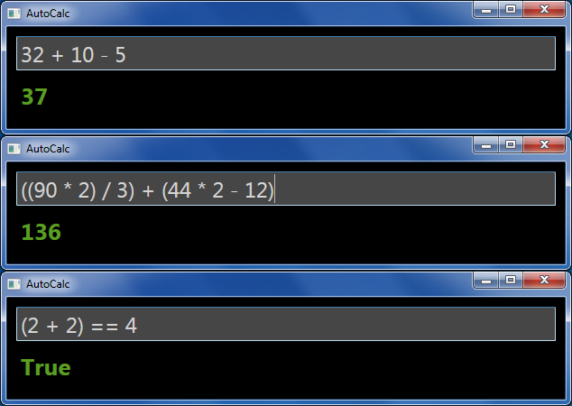

# AutoCalc

A simple calculator that accepts formulas of varying complexity and can produce results on-the-fly.

Uses WPF, implements [ncalc](https://www.nuget.org/packages/ncalc/) for expression parsing. Supports logical tests and hexadecimal input/output.

* Press **Enter** to copy the result to the clipboard, and **Escape** to reset the calculator.
* Press **Ctrl-Shift** to toggle between decimal and hexadecimal output.

